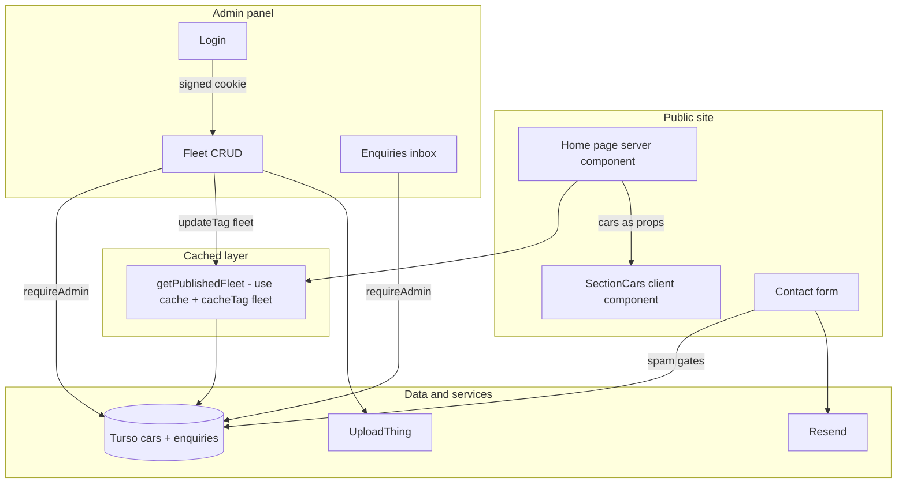
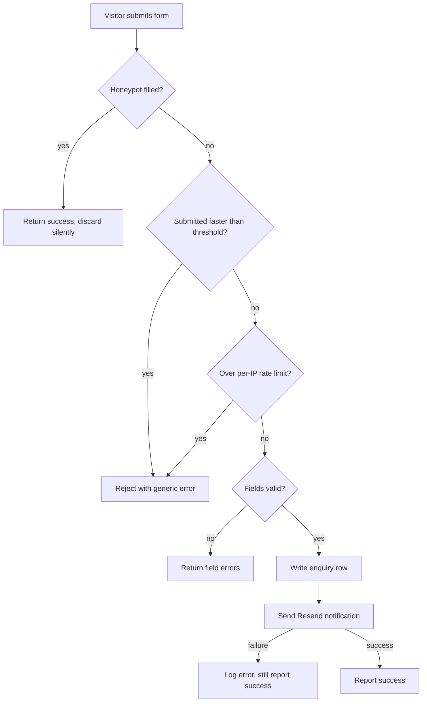

# Fleet Admin Panel - Plan

## Goal Capsule

**Objective.** Move the Sol Noosa fleet out of hard-coded source and into a Turso database that the business owner can edit through a password-protected admin panel, and capture contact enquiries in the same database instead of dropping them.

**Product authority.** Joschua (developer). Sol Noosa is the client; items needing their input are listed in `client-todo.md`.

**Authority hierarchy.** The Product Contract below governs behaviour; the Planning Contract governs implementation. Where research contradicts a Key Technical Decision, stop and surface it rather than silently substituting an approach.

**Execution profile.** Sequential units in dependency order on a single branch. Units 1-4 are foundation and must land before any admin surface is built. Work runs against **live production services**, not local stubs, and each unit is verified in the browser before moving on. The site is not live yet, so dummy cars and test enquiries are acceptable during the build and are cleaned out before launch.

**Credential checkpoints.** Joschua adds credentials to the environment; the implementer stops and asks rather than stubbing, mocking, or inventing a value. `TURSO_DB_URL` and `TURSO_TOKEN` are already populated, so U1 can start immediately. Remaining stops:

| Before | Needs | Where it comes from |
|---|---|---|
| U2 | `ADMIN_PASSWORD` | Chosen by Joschua |
| U7 | `UPLOADTHING_TOKEN` | UploadThing dashboard, new app |
| U9 | `RESEND_API_KEY`, `RESEND_FROM_EMAIL`, `ENQUIRY_NOTIFICATION_EMAIL` | Resend account with a verified domain (OQ-1 — client input) |

**Stop conditions.** Stop and ask if: a credential above is missing or rejected by the service; enabling Cache Components breaks an existing page in a way not resolved by adding `use cache` (U3); the UploadThing route cannot be authenticated with the session (U7); or a Turso schema push would drop existing data.

**Open blockers.** None blocking a start. The UploadThing and Resend accounts must exist by U7 and U9 respectively; the Turso database is already reachable.

**Product Contract preservation.** Product scope unchanged; two technical corrections: FR-1 now names `imageKey` (required for photo deletion), and KD-4's mechanism names `updateTag` rather than the form of `revalidateTag` deprecated in Next.js 16. All other planning decisions (schema push strategy, test scope, Cache Components migration) live in the Planning Contract.

---

## Product Contract

### Summary

Replace the hard-coded fleet with a Turso-backed `cars` table edited through a password-protected, mobile-first admin panel, and capture contact enquiries in the same database with email notification and spam hardening on the public form.

### Problem & Context

The five cars shown on the home page are a hard-coded array in `lib/cars.ts`, consumed only by `components/home/section-cars.tsx`. Every price change, new vehicle, or sold vehicle requires a code edit and a deploy — which means it requires Joschua. The client cannot maintain their own fleet listing.

The contact form has the same shape of problem in a worse form: `components/contact-form.tsx` submits to `console.log`. Enquiries submitted today are lost entirely.

Current state, verified:

- `lib/cars.ts` — 5 cars, fields `id`, `name`, `type`, `seats`, `transmission`, `pricePerDay`
- `components/home/section-cars.tsx` — the sole consumer, a `'use client'` component using Swiper
- Car cards render a grey placeholder div where a photo would go; no car images exist in `public/`
- `.env.schema` declares `TURSO_DB_URL` and `TURSO_TOKEN`, but `package.json` has no `drizzle-orm`, `@libsql/client`, `uploadthing`, or `resend`
- No `app/admin` route, no `proxy.ts`, and `cacheComponents` is not enabled in `next.config.ts`

### Users & Actors

- **Fleet editor** (one person, the business owner or Joschua acting for them). Non-technical. Logs in with a single shared password to add, edit, reorder, hide, and delete cars, and to read enquiries.
- **Site visitor.** Sees the published fleet and submits the contact form. Never authenticates.

### In Scope

Fleet management, enquiry capture, and the authentication and storage needed to support both.

### Out of Scope

- Per-car description copy and car detail pages — the card design is unchanged
- Multi-user accounts, roles, password reset, invitations, audit logging
- Editing site copy (hero, about, why-us, taglines) — stays in code
- Booking, availability calendars, or payments
- Multiple photos per car / image galleries

### Requirements

**Data**

- FR-1. A `cars` table holds the existing five fields plus `imageUrl` and `imageKey` (both nullable), `published` (boolean), `sortOrder` (integer), and created/updated timestamps.
- FR-2. An `enquiries` table holds the contact form's four fields (`fullName`, `phoneNumber`, `email`, `message`) plus a received timestamp.
- FR-3. The five cars currently in `lib/cars.ts` are seeded as the initial `cars` rows, preserving their current order, so the public site looks identical the moment the switch happens.
- FR-4. Access goes through Drizzle relational queries (`db.query.cars.findMany(...)`), consistent with project convention.

**Authentication**

- FR-5. A single shared password, held in the environment (via varlock — `import { ENV } from 'varlock/env'`, never `process.env`), gates all of `/admin`.
- FR-6. A successful password submission establishes a signed, httpOnly, sameSite session cookie expiring after 30 days. The raw password is never stored in the cookie.
- FR-7. Every admin page and every mutating action verifies the session server-side. A `proxy.ts` redirect, if used, is an optimistic UX convenience only and is never the sole protection — Next.js 16 explicitly documents Proxy as unsuitable for authorization.
- FR-8. The UploadThing upload route is authenticated with the same session check. **This is the highest-risk surface in the feature** — an unguarded upload route is a public, anonymous file-upload endpoint on the production domain, independent of how simple the login is.
- FR-9. `/admin` is excluded from indexing (`noindex`) and from `sitemap`/`robots` exposure.

**Fleet administration**

- FR-10. The editor can create, edit, and delete cars, and reorder them manually; the public fleet renders in that order.
- FR-11. Each car may have zero or one photo, uploaded via UploadThing. Cars without a photo render the existing grey placeholder, so a car can be added before its photo exists.
- FR-12. Publish/unpublish hides a car from the public site without deleting it. Unpublished cars remain visible and editable in the admin.
- FR-13. Deleting a car also deletes its UploadThing file. Replacing a car's photo deletes the superseded file. Orphaned uploads are not acceptable.
- FR-14. Destructive actions (delete a car) require confirmation.
- FR-14a. `type` and `transmission` are free-text fields, not constrained lists. The card renders whatever the editor types, so the inputs are sized and the card verified against realistic worst-case strings rather than the current five tidy values.
- FR-14b. The admin panel is usable one-handed on a phone: touch-sized targets, no hover-only affordances, forms that survive the mobile keyboard, and reordering that works by touch. Photo upload accepts a camera capture directly.

**Enquiries**

- FR-15. Contact form submission writes an `enquiries` row and sends a notification email via Resend to the business address.
- FR-16. A failed email send must not lose the enquiry — the database write is the source of truth and succeeds independently.
- FR-17. The admin panel lists enquiries newest-first, read-only. No reply-from-admin, no status tracking, no deletion in v1.
- FR-18. The form gives the visitor real success and failure feedback, replacing the current silent `console.log`.

**Spam protection**

- FR-19. The public form is hardened before it can write to the database: a honeypot field, a minimum submit-time threshold, and per-IP rate limiting on the submission endpoint.
- FR-20. Cloudflare Turnstile is the designated upgrade path if honeypot-plus-timing proves insufficient. It is not in the v1 build.

**Public site**

- FR-21. The fleet is read from the database through a cached query tagged `fleet`; every admin mutation invalidates that tag so edits appear on the next request.
- FR-22. `section-cars.tsx` stays a client component (Swiper); a server parent performs the query and passes cars down as props.
- FR-23. The fleet section's default blurb — currently the literal string `'Five cars, all local, all yours from $69 a day.'` at `components/home/section-cars.tsx:20` — is derived from the fleet data (count and minimum published price) rather than hard-coded, so it cannot contradict the fleet the client just edited.
- FR-24. Only published cars appear on the public site.

### Key Decisions

- KD-1. **Turso + Drizzle for storage.** *(session-settled: stated as a requirement at intake.)* `.env.schema` already anticipates it.
- KD-2. **UploadThing for car photos.** *(session-settled: stated as a requirement at intake.)*
- KD-3. **Single shared password, no user accounts.** *(session-settled: stated at intake with rationale — one editor, low sensitivity.)* Accepts that the password cannot be revoked per-person and rotation means changing an env var and redeploying. Correct trade for one user.
- KD-4. **Cache the fleet query and invalidate on write** (over reading live per request, or a fixed revalidation window). Chosen for prerendered page speed; accepts invalidation as a permanent maintenance surface. The mechanism is `cacheComponents: true` plus `use cache` / `cacheTag`, with `updateTag` invalidating from server actions; `unstable_cache` and the single-argument `revalidateTag(tag)` form are both superseded in Next.js 16. Enabling the flag changes prerender semantics for **all** existing pages, not just the home page.
- KD-5. **One optional photo per car**, not a gallery. Extra images have nowhere to render without a car detail page, which is out of scope.
- KD-6. **No per-car description field.** The card layout has no room for it and adding one would force a design change.
- KD-7. **Enquiries stored *and* emailed.** The admin inbox is the archive; email is how a lead actually gets noticed. Storage-only was rejected as a way to lose bookings.
- KD-8. **Honeypot first, Turnstile held in reserve.** Avoids a Cloudflare dependency and a visible challenge on a low-traffic marketing form until evidence says it's needed.
- KD-9. **`type` and `transmission` are free text.** Flexibility for the editor over guaranteed visual consistency; the card must tolerate long or oddly-cased values. Note this drops the existing `'Automatic' | 'Manual'` union in `lib/cars.ts:6` — the constraint moves from the type system to nothing, so the card layout is the only thing defending against a 40-character `type`.
- KD-10. **The admin panel is mobile-first, not desktop-with-a-media-query.** The expected workflow is photographing a car and listing it on the spot, so the phone is the primary target and the desktop layout is the adaptation.

### Assumptions

- A-1. Traffic is low enough that the choice between cached and live reads is a preference, not a performance constraint. Unvalidated — no analytics were consulted.
- A-2. The business has a monitored email address for enquiry notifications, and a domain that can be verified with Resend.
- A-3. Fleet edits are infrequent (weeks, not hours), so no optimistic UI or concurrent-edit handling is needed.
- A-4. The client will supply real car photos. Until then, published cars render the grey placeholder — the site is no worse than today.

### Risks

- R-1. Enabling `cacheComponents` is a project-wide flag. All four existing pages (`/`, `/about`, `/contact`, `/noosa`) need a verification pass afterwards. Next.js ships a migration guide for exactly this. *Mitigation: treat the flag flip as its own reviewable step, not a line in a larger change.*
- R-2. An unguarded UploadThing route is an anonymous public upload endpoint. *Mitigation: FR-8; verify by attempting an unauthenticated upload before shipping.*
- R-3. Cache invalidation misses produce "I saved it and nothing changed", which for a non-technical editor reads as the panel being broken. *Mitigation: invalidation lives with the mutation, not scattered across callers; verify each mutation path.*
- R-4. A public write path into the database is a spam vector. *Mitigation: FR-19 lands with the enquiry write, not after it.*
- R-5. A single password in an env var is unrecoverable if lost and unrotatable without a deploy. Accepted per KD-3.

### Success Criteria

1. `lib/cars.ts` no longer supplies the fleet; the home page renders the same five cars from Turso.
2. The editor can add a car with a photo, publish it, reorder it, hide it, and delete it — and see each change on the public site without a deploy.
3. An unauthenticated request to any `/admin` route or the upload endpoint is rejected.
4. A contact form submission produces both a database row and a notification email; the enquiry survives an email failure.
5. A bot-shaped submission (honeypot filled, or submitted in under the timing threshold) is rejected.
6. The fleet blurb reflects the actual fleet after the client adds a sixth car or changes the cheapest price.

### Outstanding Questions

- OQ-1. Which email address receives enquiry notifications, and from which verified sending domain? (Client input — added to `client-todo.md`.)
- OQ-2. ~~Free text or fixed lists for `type` and `transmission`?~~ Resolved 2026-07-29 → free text (KD-9, FR-14a).
- OQ-3. ~~Session lifetime for the admin cookie?~~ Resolved 2026-07-29 → 30 days (FR-6). Pairs with KD-3: since the password can't be revoked per-person, a stolen phone means rotating the env var, which also invalidates every existing session.
- OQ-4. ~~Does the admin panel need to work well on a phone?~~ Resolved 2026-07-29 → yes, mobile-first (KD-10, FR-14b).

---

## Planning Contract

### Key Technical Decisions

- KTD-1. **Turso via Drizzle, `drizzle-orm/libsql` driver.** *(session-settled: user-directed — chosen over Postgres/Supabase: the client already provisioned Turso and `.env.schema` declares its credentials.)* Instantiates KD-1. Queries use Drizzle's relational API (`db.query.cars.findMany(...)`) per project convention.
- KTD-2. **Schema applied with `drizzle-kit push`; no generated migration files.** *(session-settled: user-directed — chosen over `generate` + `migrate`: a two-table schema on a single-developer project doesn't earn a migration history to maintain.)* Consequence: schema changes after the fleet is live have no reviewable diff and no rollback path, so any push against a populated database is a stop-and-check moment.
- KTD-3. **Env access through varlock, never `process.env`.** `import { ENV } from 'varlock/env'` in application code *and* in `drizzle.config.ts`. Because `bunfig.toml` sets `env = false`, Bun does not load `.env` itself — CLI tooling must be wrapped: `varlock run -- bunx drizzle-kit push`. Reuse the existing `TURSO_DB_URL` / `TURSO_TOKEN` names already in `.env.schema` rather than the names in Drizzle's own documentation.
- KTD-4. **Cache Components enabled site-wide; fleet read tagged, admin mutations call `updateTag`.** *(session-settled: user-directed — chosen over path revalidation without the flag: the tagged-cache approach was preferred despite the migration cost.)* Instantiates KD-4. `updateTag` is the correct primitive here — it is server-action-only and gives read-your-own-writes semantics, which avoids the deprecated single-argument `revalidateTag(tag)` form. With the flag on, all pages are dynamic by default, so the four existing pages need explicit `use cache` to stay prerendered (U3).
- KTD-5. **Stateless signed-cookie session, secret held in env.** Password is compared against `ADMIN_PASSWORD`; the cookie carries a signed expiry payload, never the password. Sign with a secret **derived from the password**, so rotating `ADMIN_PASSWORD` invalidates every live session — without this, a 30-day cookie survives a password change and rotation stops being a revocation tool (OQ-3).
- KTD-6. **Authorization enforced in a data-access layer, not in `proxy.ts`.** A `requireAdmin()` helper runs inside every admin page, server action, and the upload route. `proxy.ts` performs an optimistic cookie-presence redirect for UX only. Next.js 16 documents Proxy as unsuitable as an authorization solution; treating it as the gate would leave server actions reachable directly.
- KTD-7. **Store the UploadThing file key alongside the URL.** `UTApi.deleteFiles()` takes file *keys*, not URLs, so FR-13 (delete the file when its car is deleted or its photo replaced) is impossible without persisting the key. Replacing a photo produces a new key and a new URL, which also sidesteps the `next/image` optimizer cache (default TTL is 4 hours in Next 16) — a replaced photo appears immediately because its URL changed.
- KTD-8. **Automated tests cover pure-logic seams only.** *(session-settled: user-directed — chosen over a full testing stack or no tests at all: the repo has no test infrastructure and the value concentrates in a few pure functions.)* `bun test` is built into the runtime, so no dependency is added. Covered: session token signing/verification, spam heuristics, fleet blurb derivation. Everything else is verified manually against the running site. **Design consequence:** these functions must take their inputs (secret, timestamps, fleet array) as arguments rather than reading `ENV` internally, or they are not testable without booting varlock.
- KTD-9. **Admin lives in its own route group with no marketing chrome.** The site `Header`/`Footer` in `app/layout.tsx` do not belong on admin screens, and `Providers` (booking modal context) is irrelevant there.
- KTD-10. **Honeypot plus submit-timing plus in-memory rate limiting for v1.** Instantiates KD-8. In-memory counters reset on deploy and don't span instances — acceptable for this traffic level, and the honeypot is the primary filter regardless.

### High-Level Technical Design

Read and write paths, and where the cache boundary sits:

Enquiry submission gates, in order — each rejects before a database write happens:

Silently accepting honeypot submissions rather than erroring is deliberate — a bot that gets an error learns to retry differently.

### Sequencing

U1 → U2 → U3 → U4 establish data, auth, and the public read path. U5 opens the admin shell; U6 and U7 complete fleet editing. U8 → U9 → U10 deliver the enquiry pipeline and can proceed in parallel with U5-U7 once U1 lands.

U3 (the Cache Components flag) is deliberately isolated so a rendering regression on an existing page is attributable to it rather than tangled with fleet work.

### Environment Variables

New keys to add to `.env.schema` (all `@required @sensitive`), alongside the existing `TURSO_DB_URL` and `TURSO_TOKEN`:

| Key | Purpose |
|---|---|
| `ADMIN_PASSWORD` | The single shared admin password (KD-3) |
| `UPLOADTHING_TOKEN` | UploadThing app credentials |
| `RESEND_API_KEY` | Enquiry notification sending |
| `ENQUIRY_NOTIFICATION_EMAIL` | Where enquiry notifications are delivered (OQ-1) |
| `RESEND_FROM_EMAIL` | Verified sending address |

---

## Implementation Units

| U-ID | Unit | Key files | Depends on |
|---|---|---|---|
| U1 | Database foundation and seed | `lib/db/`, `drizzle.config.ts` | — |
| U2 | Password auth and session | `lib/auth/`, `proxy.ts` | U1 |
| U3 | Enable Cache Components | `next.config.ts`, existing pages | — |
| U4 | Public fleet reads from the database | `lib/fleet.ts`, `components/home/section-cars.tsx` | U1, U3 |
| U5 | Admin shell and login screen | `app/admin/` | U2 |
| U6 | Fleet CRUD actions and forms | `app/admin/fleet/`, `lib/fleet-actions.ts` | U4, U5 |
| U7 | Car photo upload and cleanup | `app/api/uploadthing/`, admin photo field | U6 |
| U8 | Enquiry capture and spam hardening | `lib/enquiries.ts`, `components/contact-form.tsx` | U1 |
| U9 | Enquiry notification email | `lib/email.ts` | U8 |
| U10 | Admin enquiries inbox | `app/admin/enquiries/` | U5, U8 |

### U1. Database foundation and seed

**Goal.** A Turso database with `cars` and `enquiries` tables, reachable from the app through Drizzle, seeded with the five cars currently in source.

**Requirements.** FR-1, FR-2, FR-3, FR-4.

**Dependencies.** None.

**Files.**
- `package.json` — add `drizzle-orm`, `@libsql/client`; add `drizzle-kit` as a dev dependency
- `drizzle.config.ts` — create; `dialect: 'turso'`, credentials from `ENV`
- `lib/db/schema.ts` — create; `cars` and `enquiries` tables plus Drizzle relations export
- `lib/db/index.ts` — create; libsql client and `drizzle(...)` instance with schema bound for relational queries
- `lib/db/seed.ts` — create; idempotent seed of the five existing cars
- `.env.schema` — no change in this unit (Turso keys already declared)

**Approach.** `cars` carries the five existing fields plus `imageUrl`, `imageKey` (both nullable, KTD-7), `published`, `sortOrder`, and created/updated timestamps. `enquiries` carries the four form fields plus a received timestamp. `type` and `transmission` are plain text columns, not enums (KD-9) — the current `'Automatic' | 'Manual'` union in `lib/cars.ts` is deliberately not carried over.

Seed **inlines** the five cars copied from `lib/cars.ts:10-51` rather than importing that module — U4 deletes `lib/cars.ts`, and an import here would break the type check the moment it goes. Assign `sortOrder` from array position and `published: true`. Make it idempotent (skip when rows exist) so re-running is safe.

Apply the schema with `varlock run -- bunx drizzle-kit push` (KTD-3). Do not add a `db:push` script that omits the varlock wrapper — it will fail confusingly with `env = false` in `bunfig.toml`.

**Patterns to follow.** Existing shape of `lib/cars.ts:1-8` for the car type; project convention of `type` over `interface`.

**Test scenarios.** `Test expectation: none -- schema and seed definitions carry no branching logic` (KTD-8). Correctness is proven by the verification steps below.

**Verification.** Push succeeds against Turso; seed inserts exactly five cars; a scratch relational query returns them in `sortOrder` order; re-running the seed does not duplicate rows.

### U2. Password auth and session

**Goal.** A single password establishes a signed 30-day session that server-side code can verify, with an optimistic redirect for unauthenticated admin visits.

**Requirements.** FR-5, FR-6, FR-7, FR-9.

**Dependencies.** U1 (not strictly required, but auth lands before any admin surface).

**Files.**
- `lib/auth/session.ts` — create; sign and verify the session token as pure functions
- `lib/auth/index.ts` — create; `verifyPassword()`, `createSession()`, `destroySession()`, `requireAdmin()` reading cookies and `ENV`
- `lib/auth/session.test.ts` — create; `bun test` coverage of sign/verify
- `proxy.ts` — create at project root; optimistic redirect for `/admin/*`

This unit owns the session primitives only. The login and logout **server actions** that call them belong to U5 with the login screen, so the form and its action land together.

**Approach.** `session.ts` exports pure functions taking `(payload, secret)` and `(token, secret, now)` so they are testable without env (KTD-8). Derive the signing secret from `ADMIN_PASSWORD` so rotation invalidates live sessions (KTD-5). The cookie is httpOnly, sameSite lax, secure in production, 30-day max age.

`requireAdmin()` reads the cookie, verifies, and redirects to the login route when invalid — every admin page, action, and the upload route calls it (KTD-6). `proxy.ts` only checks cookie presence and never treats that check as authorization.

The proxy matcher must exclude the login route. Matching `/admin/*` wholesale redirects unauthenticated visitors to a login page that itself redirects to login — an infinite loop that presents as a broken site rather than an auth bug.

Add `robots: { index: false, follow: false }` metadata on the admin layout in U5; this unit provides the route matcher that keeps `/admin` out of the public path space.

**Execution note.** Write `session.test.ts` alongside the implementation — this is the one seam where a silent bug is invisible in the browser and security-relevant.

**Test scenarios** (`bun test`):
- A freshly signed token verifies successfully against the same secret.
- A token signed with one secret fails verification against a different secret (proves password rotation revokes sessions).
- A token whose expiry has passed fails verification when `now` is after expiry.
- A token with a tampered payload but the original signature fails verification.
- A malformed or empty token string fails verification without throwing.

**Verification.** `bun test` passes. Visiting `/admin` unauthenticated redirects to login; the correct password sets a cookie and admits; a wrong password does not; logout clears the cookie and a subsequent `/admin` visit redirects again.

### U3. Enable Cache Components

**Goal.** `cacheComponents` is on, and the four existing pages render exactly as they do today.

**Requirements.** Enabling requirement for FR-21.

**Dependencies.** None. Land this before U4 and review it on its own (R-1).

**Files.**
- `next.config.ts` — add `cacheComponents: true`
- `app/page.tsx`, `app/about/page.tsx`, `app/contact/page.tsx`, `app/noosa/page.tsx` — add `use cache` where a page should stay prerendered
- `app/layout.tsx` — only if the build flags uncached access in the layout

**Approach.** With the flag on, pages are dynamic by default and Next raises errors during dev and build on unhandled uncached data access. Work through the build output, adding `use cache` as close to the data access as possible, or at page level for these static pages. None of the four pages currently fetch data, so this should be a small change — but the build is the authority, not this prediction.

`next.config.ts` exports through `varlockNextConfigPlugin()(nextConfig)`. New options go inside the `nextConfig` object; leave the wrapper intact or env resolution breaks across the whole app.

Do not add `use cache` to anything that reads cookies or headers; cookies must be read outside a cached scope. This matters from U5 onward, where admin pages must stay dynamic.

**Patterns to follow.** `node_modules/next/dist/docs/01-app/02-guides/migrating-to-cache-components.md` is the migration reference and is the authority over any recalled convention.

**Test scenarios.** `Test expectation: none -- configuration change with no branching logic` (KTD-8).

**Verification.** `bun run build` succeeds with no cache-related errors. All four pages render identically to before the change in the browser, including fonts, hero imagery and the booking modal. Build output shows the four marketing pages still prerendered rather than dynamic.

### U4. Public fleet reads from the database

**Goal.** The home page renders the fleet from Turso through a tagged cache, with photos, publish filtering, manual ordering, and a blurb derived from the data.

**Requirements.** FR-21, FR-22, FR-23, FR-24, FR-11.

**Dependencies.** U1, U3.

**Files.**
- `lib/fleet.ts` — create; `getPublishedFleet()` with `use cache` and `cacheTag('fleet')`, plus `deriveFleetBlurb()`
- `lib/fleet.test.ts` — create; `bun test` coverage of blurb derivation
- `app/page.tsx` — fetch the fleet and pass it to the section
- `components/home/section-cars.tsx` — accept `cars` as a prop; render photo or placeholder
- `next.config.ts` — add the UploadThing host to `images.remotePatterns`
- `lib/cars.ts` — delete once the seed has run and nothing imports it

**Approach.** `getPublishedFleet()` returns only published cars ordered by `sortOrder`, cached and tagged `fleet` so U6's mutations can invalidate it. `section-cars.tsx` stays a client component for Swiper and receives cars as props from the server page (FR-22).

`deriveFleetBlurb(cars)` replaces the hard-coded default at `components/home/section-cars.tsx:20`, producing the count and minimum price from the data. Keep it a pure function taking the fleet array so it is testable (KTD-8). Handle the empty and single-car cases — an empty fleet must not render "0 cars from $Infinity a day".

Photos render through `next/image` with the aspect ratio the existing placeholder uses; cars without a photo keep the current grey placeholder (FR-11). `remotePatterns` must name the UploadThing host specifically, not a wildcard.

**Patterns to follow.** Existing card markup in `components/home/section-cars.tsx:49-73` — the visual design does not change. Free-text `type` values mean the card must tolerate long strings (KD-9), so check a long value against the layout at `section-cars.tsx:57`.

**Test scenarios** (`bun test`, blurb derivation only):
- A five-car fleet with a $69 minimum produces a blurb naming five cars and $69.
- A single-car fleet uses singular phrasing rather than "1 cars".
- An empty fleet returns a sensible fallback with no price and no `Infinity`.
- The minimum price reflects only published cars when unpublished cheaper cars exist.

**Verification.** `bun test` passes. The home page renders the same five cars as before the change. Toggling `published` to false in the database removes a car from the site on the next request; changing `sortOrder` reorders the carousel. A car with a long `type` value does not break the card layout.

### U5. Admin shell and login screen

**Goal.** A mobile-first `/admin` area behind the password, with its own layout and no marketing chrome.

**Requirements.** FR-5, FR-9, FR-14b.

**Dependencies.** U2.

**Files.**
- `app/admin/layout.tsx` — create; admin chrome, `robots` noindex metadata
- `app/admin/login/page.tsx` — create; password form
- `app/admin/page.tsx` — create; landing view linking fleet and enquiries
- `lib/auth/actions.ts` — create; login and logout server actions wrapping U2's `verifyPassword` / `createSession` / `destroySession`

**Approach.** The admin route group defines its own layout rather than inheriting the site `Header`/`Footer` (KTD-9). Design for the phone first: touch-sized targets, no hover-only affordances, single-column forms (FR-14b, KD-10).

Every admin page calls `requireAdmin()` — the layout alone is not sufficient, since layouts do not re-run for every nested entry point and server actions are reachable independently (KTD-6).

Login failures must not reveal whether the password was close; a single generic message.

**Patterns to follow.** `components/ui/` primitives (`button`, `input`, `label`) and the design tokens in `app/globals.css` — the admin should look like the same product, just plainer. Server-action form handling follows the pattern established here for U6 and U8 to reuse.

**Test scenarios.** `Test expectation: manual verification only -- auth logic is covered by U2's session tests; this unit is routing and layout` (KTD-8). Manual cases: unauthenticated visit to `/admin` and `/admin/fleet` both redirect; correct password admits; session survives a browser restart within 30 days; logout returns to login.

**Verification.** Admin renders correctly at 375px width with no horizontal scroll and no site header or footer. `/admin` returns noindex headers. Every admin route is unreachable without a valid session.

### U6. Fleet CRUD actions and forms

**Goal.** The editor can create, edit, delete, reorder, and publish/unpublish cars, and the public site reflects each change on the next request.

**Requirements.** FR-10, FR-12, FR-14, FR-14a, FR-21.

**Dependencies.** U4, U5.

**Files.**
- `app/admin/fleet/page.tsx` — create; list with publish toggle and ordering controls
- `app/admin/fleet/[id]/page.tsx` — create; edit form
- `app/admin/fleet/new/page.tsx` — create; create form
- `lib/fleet-actions.ts` — create; create, update, delete, reorder, publish server actions

**Approach.** Every action calls `requireAdmin()` first, then `updateTag('fleet')` after a successful write (KTD-4) — `updateTag` is server-action-only and gives read-your-own-writes, so the editor sees the change immediately rather than a stale page.

`type` and `transmission` are free-text inputs (KD-9, FR-14a). Validate that price and seats are positive numbers and that name is non-empty; beyond that, trust the editor.

Reordering must work by touch (KD-10) — prefer explicit move-up/move-down controls or a position field over drag-and-drop, which is the worst option on a phone. Deleting requires a confirmation step (FR-14).

**Patterns to follow.** `@tanstack/react-form` as used in `components/contact-form.tsx:15-25` for client-side form state; `components/ui/` primitives for inputs.

**Test scenarios.** `Test expectation: manual verification only -- these are database writes and framework cache calls, outside the pure-logic seam scope` (KTD-8). Manual cases:
- Creating a car makes it appear on the home page without a rebuild or deploy.
- Editing a price updates the public card on the next request.
- Unpublishing removes the car from the public site but keeps it listed in the admin.
- Reordering changes carousel order, and works by touch on a phone.
- Deleting prompts for confirmation, and cancelling leaves the car intact.
- A car created with an empty name or a negative price is rejected with a visible message.

**Verification.** Each manual case above passes against a running dev server. Calling a fleet action without a valid session fails rather than mutating.

### U7. Car photo upload and cleanup

**Goal.** The editor uploads one photo per car from a phone, and replaced or deleted photos are removed from UploadThing.

**Requirements.** FR-8, FR-11, FR-13.

**Dependencies.** U6.

**Files.**
- `package.json` — add `uploadthing` and `@uploadthing/react`
- `app/api/uploadthing/core.ts` — create; file router with auth in `.middleware()`
- `app/api/uploadthing/route.ts` — create; `createRouteHandler` export
- `lib/uploadthing.ts` — create; `UTApi` instance for server-side deletion
- `app/admin/fleet/[id]/page.tsx` — add the photo field
- `.env.schema` — add `UPLOADTHING_TOKEN`

**Approach.** The file router's `.middleware()` calls the same session check as the admin pages and throws `UploadThingError` when unauthenticated (FR-8, KTD-6). **This is the highest-risk item in the plan** — without it, the route is an anonymous public upload endpoint on the production domain, and the simplicity of the password auth is irrelevant.

Persist both `imageUrl` and `imageKey` on upload completion (KTD-7). Deleting a car deletes its file via `UTApi.deleteFiles(imageKey)`; replacing a photo deletes the superseded key after the new one is stored (FR-13). Order matters — write the new key first, then delete the old one, so a failure mid-way leaves an orphaned file rather than a car pointing at a deleted image.

Cache invalidation needs care here: `updateTag` is server-action-only and the upload completion handler is a route handler, so it cannot call it. Either invalidate with `revalidateTag`'s two-argument form from the handler, or have the admin form persist the returned URL and key through a normal server action — the second keeps every fleet write on one invalidation path. The single-argument `revalidateTag(tag)` form is deprecated in Next 16 and must not be used.

Accept camera capture directly from the upload control so the editor can photograph a car and list it on the spot (KD-10, FR-14b).

**Execution note.** Before considering this unit done, attempt an upload with the session cookie cleared and confirm it is rejected. Do not infer this from reading the middleware.

**Test scenarios.** `Test expectation: manual verification only -- the seam is a third-party route handler, not local logic` (KTD-8). Manual cases:
- Uploading from the admin attaches the photo and it appears on the public card.
- An upload attempted without a session is rejected.
- Replacing a photo shows the new image immediately and removes the old file from the UploadThing dashboard.
- Deleting a car removes its file from the UploadThing dashboard.
- A car with no photo still renders the grey placeholder publicly.

**Verification.** All five manual cases pass, with the UploadThing dashboard confirming no orphaned files after a create-replace-delete cycle.

### U8. Enquiry capture and spam hardening

**Goal.** Contact submissions persist to Turso behind spam gates, and the visitor gets real feedback.

**Requirements.** FR-15, FR-16, FR-18, FR-19.

**Dependencies.** U1.

**Files.**
- `lib/enquiries.ts` — create; submission server action
- `lib/spam.ts` — create; honeypot, timing, and rate-limit checks as pure functions
- `lib/spam.test.ts` — create; `bun test` coverage
- `components/contact-form.tsx` — replace the `console.log` at line 23 with the action; add hidden honeypot field, render time, success and error states

**Approach.** Gates run in the order shown in the design diagram, all before the database write. The honeypot is a hidden field a human never fills; a filled honeypot returns a success response and discards the submission silently so bots learn nothing. Timing rejects submissions faster than a human could complete the form. Rate limiting is per-IP and in-memory (KTD-10).

Keep the gate functions pure — take the submitted values, timestamps, and counters as arguments so they test without env or a request context (KTD-8).

The form currently gives no feedback at all; add explicit pending, success, and failure states (FR-18).

**Patterns to follow.** Existing `@tanstack/react-form` structure in `components/contact-form.tsx:15-111`; keep the `onDarkSurface` prop behaviour intact since the home page section uses it.

**Test scenarios** (`bun test`, gate logic only):
- A filled honeypot value is classified as spam.
- An empty honeypot with realistic timing passes.
- A submission faster than the timing threshold is rejected.
- A submission at exactly the threshold boundary is accepted (documents the boundary).
- Requests under the per-IP limit pass; the request that exceeds it is rejected.
- Rate-limit counters for different IPs do not interfere.

**Verification.** `bun test` passes. A real submission creates an `enquiries` row and shows a success state; a submission with the honeypot populated creates no row but shows success; a failed write shows an error state rather than silently succeeding.

### U9. Enquiry notification email

**Goal.** A new enquiry sends a notification email, and an email failure never loses the enquiry.

**Requirements.** FR-15, FR-16.

**Dependencies.** U8.

**Files.**
- `package.json` — add `resend`
- `lib/email.ts` — create; notification send
- `lib/enquiries.ts` — call the send after the write succeeds
- `.env.schema` — add `RESEND_API_KEY`, `ENQUIRY_NOTIFICATION_EMAIL`, `RESEND_FROM_EMAIL`

**Approach.** Send only after the database write commits, and never let a send failure propagate into the visitor's response (FR-16) — log it and report success, because the enquiry is safely stored and the inbox is the backup. The email carries all four submitted fields and the received time, with the enquirer's address as reply-to so replying works directly from the mail client.

Sending requires a verified domain (A-2, OQ-1); until the client supplies one, use Resend's test address for local verification.

**Test scenarios.** `Test expectation: manual verification only -- the seam is a third-party send call` (KTD-8). Manual cases: a submission delivers an email containing all four fields; reply-to is the enquirer's address; with an invalid API key the submission still succeeds and the row is still written.

**Verification.** All three manual cases pass, with the failure case confirmed by temporarily breaking the key and checking that the row exists and the visitor sees success.

### U10. Admin enquiries inbox

**Goal.** The editor can read enquiries, newest first.

**Requirements.** FR-17.

**Dependencies.** U5, U8.

**Files.**
- `app/admin/enquiries/page.tsx` — create; read-only list

**Approach.** Read-only by design (FR-17) — no reply, no status tracking, no deletion in v1. Newest first. Must stay dynamic (it reads cookies via `requireAdmin()`), so no `use cache` here. Readable on a phone: full message text without truncation that hides content, and tap-to-call and tap-to-email on the phone number and address.

**Patterns to follow.** The admin layout and list patterns from U5 and U6.

**Test scenarios.** `Test expectation: manual verification only -- read-only view with no branching logic` (KTD-8). Manual cases: submitted enquiries appear newest first; the page is unreachable without a session; long messages render fully on a 375px viewport.

**Verification.** All three manual cases pass.

---

## Verification Contract

| Gate | Command | Applies to |
|---|---|---|
| Unit tests | `bun test` | U2, U4, U8 |
| Type check | `bunx tsc --noEmit` | All units |
| Lint | `bun run lint` | All units |
| Production build | `bun run build` | U3 especially; all units before done |
| Schema push | `varlock run -- bunx drizzle-kit push` | U1 |
| Manual browser pass | `bun run dev` on port 4848 | All units |

Automated coverage is deliberately narrow (KTD-8): `bun test` covers session sign/verify, spam gates, and blurb derivation. Every other unit states its manual cases explicitly in its Test scenarios, and those cases are the verification of record — they are not optional.

Verification runs in the browser against live services, unit by unit, rather than being deferred to the end. The mobile pass is part of that, not polish: check every admin screen at 375px width (KD-10).

Because the services are real, verification leaves real artifacts — test cars in Turso, uploaded files in UploadThing, enquiry rows and delivered emails. That is expected while the site is unlaunched. Track what gets created so it can be cleared before launch.

---

## Definition of Done

**Global**

- The home page renders the fleet from Turso; `lib/cars.ts` is deleted and nothing imports it.
- All four existing marketing pages render identically to before the Cache Components flag flip and remain prerendered.
- No route under `/admin`, and no upload endpoint, is reachable without a valid session.
- Every admin screen is usable one-handed at 375px width.
- An enquiry submitted from the public form produces both a database row and a notification email, and survives an email failure.
- `bun test`, `bunx tsc --noEmit`, `bun run lint`, and `bun run build` all pass.
- `.env.schema` documents every new key; no secret is committed.
- Dead-end and experimental code from abandoned approaches is removed, not left in the diff.
- `client-todo.md` and `working-notes.md` reflect anything the client still owes and anything learned during the build.
- Test data created against production services during the build is inventoried, with a note of what must be cleared before launch (dummy cars, uploaded test files, test enquiry rows).

**Per unit.** Each unit's own Verification block is satisfied, including the manual cases listed under its Test scenarios, confirmed in the browser against live services.
